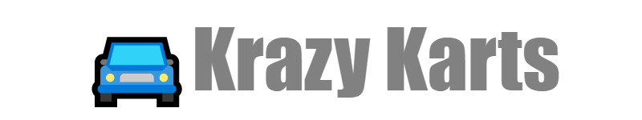

	

<h1 align="center">Krazy Karts</h1>

<h2>Overview</h2>
Project for practicing techniques of state synchronisation and interpolation between server and client using replication. Based on Vehicle template, but car was overwritten from scratch with simplified movement.

<h2>Prerequisites</h2>
<ul>
	<li>Unreal Engine 4.27.2
</ul>

<h2>[WIP]Demonstration</h2>

<h2>Controls</h2>
<ul>
	<li>W - move forward
	<li>S - move backward
	<li>A - rotate left
	<li>D - rotate right
</ul>

<h2>Known bugs</h2>
Did not find bugs

<h2>License</h2>
Access to the sources of this project and their use are governed by the [Unreal Engine End User License Agreement](https://www.unrealengine.com/eula)